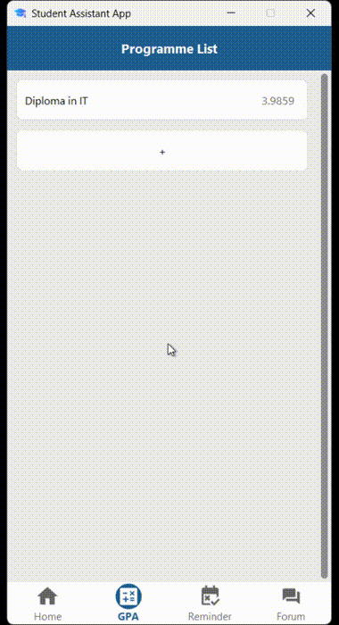

# 🎓 Student Toolkit

A **multi-feature desktop toolkit** designed to assist students in managing their academic life efficiently.  
This project integrates **a forum**, **a reminder system**, and **a GPA calculator** — all in one platform.  

---

## 🧩 Features

### 🗣️ Forum App  
A space for students to connect, share, and discuss.  
- Create posts and comments  
- Like posts
- Upload and display questions
- Search for posts based on keywords

### ⏰ Reminder App  
Never miss an important deadline again!  
- Set custom reminders for assignments, exams, or personal tasks  
- Real-time alerts when time is up

### 🎯 GPA Calculator  
Track your academic performance easily.  
- Calculate **GPA** and **CGPA** by semester  
- Add and store all assessments  
- Predict how much score is needed in the final assessment to reach your **desired grade**

---

## 🎥 Project Demo

